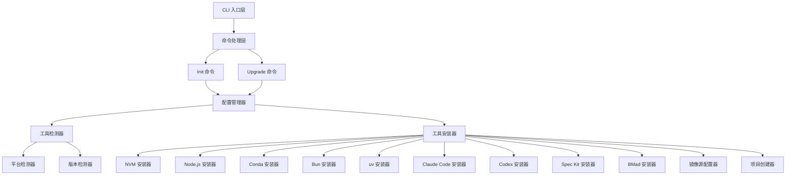

# 设计文档

## 概述

Mono-Kickstart 是一个基于 Python 3.11+ 和 Typer 框架开发的 CLI 工具，用于自动化 Monorepo 项目的初始化和开发环境配置。该工具通过检测和安装一系列开发工具（NVM、Node.js、Conda、Bun、uv、AI 编程助手等），配置镜像源，创建标准化项目结构，帮助开发者快速搭建开箱即用的开发环境。

### 核心设计目标

1. **自动化**: 一条命令完成所有工具的检测、安装和配置
2. **幂等性**: 可安全重复执行，不产生副作用
3. **容错性**: 单个工具失败不影响整体流程
4. **可配置**: 支持配置文件和命令行参数灵活定制
5. **跨平台**: 支持 macOS（ARM64/x86_64）和 Linux（x86_64）

### 技术栈

- **开发语言**: Python 3.11+
- **CLI 框架**: Typer（基于 Click）
- **包管理**: pyproject.toml + uv
- **配置格式**: YAML
- **分发渠道**: PyPI

## 架构

### 整体架构



### 分层设计

1. **CLI 入口层**: 注册 `mk` 和 `mono-kickstart` 两个命令入口
2. **命令处理层**: 处理 init、upgrade、help 等子命令
3. **配置管理层**: 加载和合并多源配置（CLI 参数、配置文件、默认值）
4. **工具管理层**: 检测、安装、升级各类开发工具
5. **平台适配层**: 处理不同操作系统和架构的差异

## 组件与接口

### 1. CLI 入口模块 (`cli.py`)

**职责**: 定义命令行接口和子命令

```python
import typer
from typing import Optional

app = typer.Typer(
    name="mono-kickstart",
    help="Monorepo 项目模板脚手架 CLI 工具",
    add_completion=True
)

@app.command()
def init(
    config: Optional[str] = typer.Option(None, "--config", help="配置文件路径"),
    save_config: bool = typer.Option(False, "--save-config", help="保存配置到 .kickstartrc"),
    interactive: bool = typer.Option(False, "--interactive", help="交互式配置"),
    force: bool = typer.Option(False, "--force", help="强制覆盖已有配置"),
    dry_run: bool = typer.Option(False, "--dry-run", help="模拟运行，不实际安装"),
) -> None:
    """初始化 Monorepo 项目和开发环境"""
    pass

@app.command()
def upgrade(
    tool: Optional[str] = typer.Argument(None, help="要升级的工具名称"),
    all: bool = typer.Option(False, "--all", help="升级所有工具"),
    dry_run: bool = typer.Option(False, "--dry-run", help="模拟运行，不实际升级"),
) -> None:
    """升级已安装的开发工具"""
    pass

def main():
    app()
```

**接口**:
- `init()`: 初始化命令入口
- `upgrade()`: 升级命令入口
- `main()`: 主入口函数（在 pyproject.toml 中注册）

### 2. 配置管理器 (`config.py`)

**职责**: 加载、合并和验证配置

```python
from dataclasses import dataclass, field
from typing import Dict, List, Optional
from pathlib import Path
import yaml

@dataclass
class ToolConfig:
    """单个工具的配置"""
    enabled: bool = True
    version: Optional[str] = None
    install_via: Optional[str] = None
    extra_options: Dict[str, any] = field(default_factory=dict)

@dataclass
class RegistryConfig:
    """镜像源配置"""
    npm: str = "https://registry.npmmirror.com/"
    bun: str = "https://registry.npmmirror.com/"
    pypi: str = "https://mirrors.sustech.edu.cn/pypi/web/simple"
    python_install: str = "https://ghfast.top/https://github.com/astral-sh/python-build-standalone/releases/download"

@dataclass
class ProjectConfig:
    """项目配置"""
    name: Optional[str] = None

@dataclass
class Config:
    """完整配置"""
    project: ProjectConfig = field(default_factory=ProjectConfig)
    tools: Dict[str, ToolConfig] = field(default_factory=dict)
    registry: RegistryConfig = field(default_factory=RegistryConfig)

class ConfigManager:
    """配置管理器"""
    
    def __init__(self):
        self.config = Config()
    
    def load_from_file(self, path: Path) -> Config:
        """从 YAML 文件加载配置"""
        pass
    
    def load_from_defaults(self) -> Config:
        """加载默认配置"""
        pass
    
    def merge_configs(self, *configs: Config) -> Config:
        """合并多个配置，后面的覆盖前面的"""
        pass
    
    def load_with_priority(
        self,
        cli_config: Optional[Path] = None,
        project_config: Path = Path(".kickstartrc"),
        user_config: Path = Path.home() / ".kickstartrc"
    ) -> Config:
        """按优先级加载配置: CLI > 项目 > 用户 > 默认"""
        pass
    
    def save_to_file(self, config: Config, path: Path) -> None:
        """保存配置到 YAML 文件"""
        pass
    
    def validate(self, config: Config) -> List[str]:
        """验证配置，返回错误列表"""
        pass
```

**接口**:
- `load_from_file()`: 从文件加载配置
- `load_with_priority()`: 按优先级加载多源配置
- `merge_configs()`: 合并配置
- `save_to_file()`: 保存配置
- `validate()`: 验证配置有效性

### 3. 平台检测器 (`platform_detector.py`)

**职责**: 检测操作系统、架构和 Shell 类型

```python
from enum import Enum
from dataclasses import dataclass
import platform
import os

class OS(Enum):
    MACOS = "macos"
    LINUX = "linux"
    UNSUPPORTED = "unsupported"

class Arch(Enum):
    ARM64 = "arm64"
    X86_64 = "x86_64"
    UNSUPPORTED = "unsupported"

class Shell(Enum):
    BASH = "bash"
    ZSH = "zsh"
    FISH = "fish"
    UNKNOWN = "unknown"

@dataclass
class PlatformInfo:
    """平台信息"""
    os: OS
    arch: Arch
    shell: Shell
    shell_config_file: str

class PlatformDetector:
    """平台检测器"""
    
    def detect_os(self) -> OS:
        """检测操作系统"""
        pass
    
    def detect_arch(self) -> Arch:
        """检测 CPU 架构"""
        pass
    
    def detect_shell(self) -> Shell:
        """检测当前 Shell 类型"""
        pass
    
    def get_shell_config_file(self, shell: Shell) -> str:
        """获取 Shell 配置文件路径"""
        pass
    
    def detect_all(self) -> PlatformInfo:
        """检测所有平台信息"""
        pass
    
    def is_supported(self) -> bool:
        """检查当前平台是否支持"""
        pass
```

**接口**:
- `detect_os()`: 检测操作系统
- `detect_arch()`: 检测架构
- `detect_shell()`: 检测 Shell
- `detect_all()`: 一次性检测所有信息
- `is_supported()`: 检查平台支持性

### 4. 工具检测器 (`tool_detector.py`)

**职责**: 检测工具是否已安装及其版本

```python
from dataclasses import dataclass
from typing import Optional
import subprocess
import shutil

@dataclass
class ToolStatus:
    """工具状态"""
    name: str
    installed: bool
    version: Optional[str] = None
    path: Optional[str] = None

class ToolDetector:
    """工具检测器"""
    
    def is_command_available(self, command: str) -> bool:
        """检查命令是否在 PATH 中可用"""
        pass
    
    def get_command_version(self, command: str, version_arg: str = "--version") -> Optional[str]:
        """获取命令的版本号"""
        pass
    
    def detect_nvm(self) -> ToolStatus:
        """检测 NVM"""
        pass
    
    def detect_node(self) -> ToolStatus:
        """检测 Node.js"""
        pass
    
    def detect_conda(self) -> ToolStatus:
        """检测 Conda"""
        pass
    
    def detect_bun(self) -> ToolStatus:
        """检测 Bun"""
        pass
    
    def detect_uv(self) -> ToolStatus:
        """检测 uv"""
        pass
    
    def detect_claude_code(self) -> ToolStatus:
        """检测 Claude Code CLI"""
        pass
    
    def detect_codex(self) -> ToolStatus:
        """检测 Codex CLI"""
        pass
    
    def detect_spec_kit(self) -> ToolStatus:
        """检测 Spec Kit"""
        pass
    
    def detect_bmad(self) -> ToolStatus:
        """检测 BMad Method"""
        pass
    
    def detect_all_tools(self) -> Dict[str, ToolStatus]:
        """检测所有工具"""
        pass
```

**接口**:
- `is_command_available()`: 检查命令可用性
- `get_command_version()`: 获取版本号
- `detect_<tool>()`: 检测特定工具
- `detect_all_tools()`: 批量检测

### 5. 工具安装器基类 (`installer_base.py`)

**职责**: 定义工具安装器的通用接口

```python
from abc import ABC, abstractmethod
from dataclasses import dataclass
from typing import Optional
from enum import Enum

class InstallResult(Enum):
    SUCCESS = "success"
    SKIPPED = "skipped"
    FAILED = "failed"

@dataclass
class InstallReport:
    """安装报告"""
    tool_name: str
    result: InstallResult
    message: str
    version: Optional[str] = None
    error: Optional[str] = None

class ToolInstaller(ABC):
    """工具安装器基类"""
    
    def __init__(self, platform_info: PlatformInfo, config: ToolConfig):
        self.platform_info = platform_info
        self.config = config
    
    @abstractmethod
    def install(self) -> InstallReport:
        """安装工具"""
        pass
    
    @abstractmethod
    def upgrade(self) -> InstallReport:
        """升级工具"""
        pass
    
    @abstractmethod
    def verify(self) -> bool:
        """验证安装是否成功"""
        pass
    
    def run_command(self, command: str, shell: bool = True) -> tuple[int, str, str]:
        """执行 shell 命令"""
        pass
    
    def download_file(self, url: str, dest: str) -> bool:
        """下载文件"""
        pass
```

**接口**:
- `install()`: 安装工具
- `upgrade()`: 升级工具
- `verify()`: 验证安装
- `run_command()`: 执行命令
- `download_file()`: 下载文件

### 6. 具体工具安装器

每个工具都有独立的安装器类，继承自 `ToolInstaller`：

- `NVMInstaller`: 安装 NVM
- `NodeInstaller`: 通过 NVM 安装 Node.js
- `CondaInstaller`: 安装 Miniconda
- `BunInstaller`: 安装 Bun
- `UVInstaller`: 安装 uv
- `ClaudeCodeInstaller`: 安装 Claude Code CLI
- `CodexInstaller`: 安装 Codex CLI
- `SpecKitInstaller`: 安装 Spec Kit
- `BMadInstaller`: 安装 BMad Method

每个安装器实现特定工具的安装逻辑，包括：
- 下载安装脚本或二进制文件
- 执行安装命令
- 配置环境变量
- 验证安装结果

### 7. 镜像源配置器 (`mirror_config.py`)

**职责**: 配置各工具的镜像源

```python
from pathlib import Path
from typing import Dict

class MirrorConfigurator:
    """镜像源配置器"""
    
    def __init__(self, registry_config: RegistryConfig):
        self.registry_config = registry_config
    
    def configure_npm_mirror(self) -> bool:
        """配置 npm 镜像源"""
        pass
    
    def configure_bun_mirror(self) -> bool:
        """配置 Bun 镜像源"""
        pass
    
    def configure_uv_mirror(self) -> bool:
        """配置 uv PyPI 镜像源和 CPython 下载代理"""
        pass
    
    def verify_npm_mirror(self) -> bool:
        """验证 npm 镜像源配置"""
        pass
    
    def verify_bun_mirror(self) -> bool:
        """验证 Bun 镜像源配置"""
        pass
    
    def verify_uv_mirror(self) -> bool:
        """验证 uv 镜像源配置"""
        pass
    
    def configure_all(self) -> Dict[str, bool]:
        """配置所有镜像源"""
        pass
```

**接口**:
- `configure_<tool>_mirror()`: 配置特定工具的镜像源
- `verify_<tool>_mirror()`: 验证镜像源配置
- `configure_all()`: 批量配置

### 8. 项目创建器 (`project_creator.py`)

**职责**: 创建 Monorepo 项目结构

```python
from pathlib import Path
from typing import List

class ProjectCreator:
    """项目创建器"""
    
    def __init__(self, project_name: str, project_path: Path):
        self.project_name = project_name
        self.project_path = project_path
    
    def create_directory_structure(self) -> None:
        """创建目录结构"""
        pass
    
    def create_workspace_config(self) -> None:
        """创建 workspace 配置文件"""
        pass
    
    def create_gitignore(self) -> None:
        """创建 .gitignore 文件"""
        pass
    
    def create_readme(self) -> None:
        """创建 README.md 文件"""
        pass
    
    def init_git_repo(self) -> None:
        """初始化 Git 仓库"""
        pass
    
    def create_project(self) -> bool:
        """创建完整项目"""
        pass
```

**接口**:
- `create_directory_structure()`: 创建目录
- `create_workspace_config()`: 创建配置
- `create_gitignore()`: 创建 .gitignore
- `create_readme()`: 创建 README
- `init_git_repo()`: 初始化 Git
- `create_project()`: 执行完整创建流程

### 9. 安装编排器 (`orchestrator.py`)

**职责**: 编排整个安装流程

```python
from typing import List, Dict
from rich.progress import Progress
from rich.console import Console

class InstallOrchestrator:
    """安装编排器"""
    
    def __init__(
        self,
        config: Config,
        platform_info: PlatformInfo,
        dry_run: bool = False
    ):
        self.config = config
        self.platform_info = platform_info
        self.dry_run = dry_run
        self.console = Console()
    
    def get_install_order(self) -> List[str]:
        """获取工具安装顺序"""
        pass
    
    def install_tool(self, tool_name: str) -> InstallReport:
        """安装单个工具"""
        pass
    
    def install_all_tools(self) -> Dict[str, InstallReport]:
        """按顺序安装所有工具"""
        pass
    
    def configure_mirrors(self) -> Dict[str, bool]:
        """配置镜像源"""
        pass
    
    def create_project(self) -> bool:
        """创建项目结构"""
        pass
    
    def run_init(self) -> None:
        """执行完整初始化流程"""
        pass
    
    def run_upgrade(self, tool_name: Optional[str] = None) -> Dict[str, InstallReport]:
        """执行升级流程"""
        pass
    
    def print_summary(self, reports: Dict[str, InstallReport]) -> None:
        """打印安装摘要"""
        pass
```

**接口**:
- `get_install_order()`: 确定安装顺序
- `install_tool()`: 安装单个工具
- `install_all_tools()`: 批量安装
- `configure_mirrors()`: 配置镜像
- `create_project()`: 创建项目
- `run_init()`: 执行 init 命令
- `run_upgrade()`: 执行 upgrade 命令
- `print_summary()`: 打印摘要

### 10. 交互式配置器 (`interactive.py`)

**职责**: 提供交互式配置向导

```python
from typing import List, Dict
import questionary

class InteractiveConfigurator:
    """交互式配置器"""
    
    def __init__(self, default_config: Config):
        self.default_config = default_config
    
    def ask_project_name(self) -> str:
        """询问项目名称"""
        pass
    
    def ask_tools_to_install(self) -> List[str]:
        """询问要安装的工具"""
        pass
    
    def ask_node_version(self) -> str:
        """询问 Node.js 版本"""
        pass
    
    def ask_python_version(self) -> str:
        """询问 Python 版本"""
        pass
    
    def ask_use_china_mirrors(self) -> bool:
        """询问是否使用中国镜像"""
        pass
    
    def run_wizard(self) -> Config:
        """运行完整配置向导"""
        pass
    
    def confirm_config(self, config: Config) -> bool:
        """显示配置摘要并确认"""
        pass
```

**接口**:
- `ask_<option>()`: 询问特定配置项
- `run_wizard()`: 运行完整向导
- `confirm_config()`: 确认配置

## 数据模型

### 配置数据模型

```python
# 工具配置
@dataclass
class ToolConfig:
    enabled: bool = True
    version: Optional[str] = None
    install_via: Optional[str] = None  # 安装方式（如 bun/npm/brew）
    extra_options: Dict[str, any] = field(default_factory=dict)

# 镜像源配置
@dataclass
class RegistryConfig:
    npm: str = "https://registry.npmmirror.com/"
    bun: str = "https://registry.npmmirror.com/"
    pypi: str = "https://mirrors.sustech.edu.cn/pypi/web/simple"
    python_install: str = "https://ghfast.top/https://github.com/astral-sh/python-build-standalone/releases/download"

# 项目配置
@dataclass
class ProjectConfig:
    name: Optional[str] = None

# 完整配置
@dataclass
class Config:
    project: ProjectConfig = field(default_factory=ProjectConfig)
    tools: Dict[str, ToolConfig] = field(default_factory=dict)
    registry: RegistryConfig = field(default_factory=RegistryConfig)
```

### 平台信息模型

```python
@dataclass
class PlatformInfo:
    os: OS  # macos / linux / unsupported
    arch: Arch  # arm64 / x86_64 / unsupported
    shell: Shell  # bash / zsh / fish / unknown
    shell_config_file: str  # ~/.bashrc / ~/.zshrc / ~/.config/fish/config.fish
```

### 工具状态模型

```python
@dataclass
class ToolStatus:
    name: str
    installed: bool
    version: Optional[str] = None
    path: Optional[str] = None
```

### 安装报告模型

```python
class InstallResult(Enum):
    SUCCESS = "success"
    SKIPPED = "skipped"
    FAILED = "failed"

@dataclass
class InstallReport:
    tool_name: str
    result: InstallResult
    message: str
    version: Optional[str] = None
    error: Optional[str] = None
```

### 工具安装顺序

工具安装必须遵循以下依赖顺序：

```python
INSTALL_ORDER = [
    "nvm",           # 1. 首先安装 NVM
    "node",          # 2. 通过 NVM 安装 Node.js
    "conda",         # 3. 安装 Conda（独立）
    "bun",           # 4. 安装 Bun（需要 Node.js 作为备选）
    "npm_mirror",    # 5. 配置 npm 镜像源
    "bun_mirror",    # 6. 配置 Bun 镜像源
    "uv",            # 7. 安装 uv
    "uv_mirror",     # 8. 配置 uv 镜像源
    "claude-code",   # 9. 安装 Claude Code CLI
    "codex",         # 10. 安装 Codex CLI（可能依赖 Bun）
    "spec-kit",      # 11. 安装 Spec Kit（依赖 uv）
    "bmad-method",   # 12. 安装 BMad Method（依赖 Node.js/Bun）
]
```

### 项目目录结构

```
<project-name>/
├── .kickstartrc          # 项目配置文件
├── .gitignore            # Git 忽略文件
├── README.md             # 项目说明
├── package.json          # Node.js workspace 配置
├── pnpm-workspace.yaml   # pnpm workspace 配置（可选）
├── apps/                 # 应用目录
│   └── .gitkeep
├── packages/             # 共享包目录
│   └── .gitkeep
└── shared/               # 共享资源目录
    └── .gitkeep
```


## 正确性属性

*属性是一种特征或行为，应该在系统的所有有效执行中保持为真——本质上是关于系统应该做什么的形式化陈述。属性是人类可读规格和机器可验证正确性保证之间的桥梁。*

### 属性 1: 工具安装顺序一致性

*对于任何*工具集合和初始安装状态，安装编排器应该按照定义的依赖顺序（NVM → Node.js → Conda → Bun → 镜像配置 → uv → uv 镜像 → Claude Code → Codex → Spec Kit → BMad）调用工具安装器。

**验证需求**: 1.1

### 属性 2: 幂等性

*对于任何*初始系统状态，执行初始化命令两次应该产生与执行一次相同的最终状态，且已安装工具的配置不应被修改。

**验证需求**: 1.2, 6.1, 6.2

### 属性 3: 平台特定安装包选择

*对于任何*支持的平台（macOS ARM64、macOS x86_64、Linux x86_64），安装器应该选择与该平台匹配的工具安装包 URL 或安装命令。

**验证需求**: 1.5, 9.1, 9.2, 9.3

### 属性 4: 条件安装方式选择

*对于任何*工具安装状态，当安装 Codex CLI 时，如果 Bun 已安装则应使用 `bun install -g`，否则应使用 `npm install -g`。

**验证需求**: 1.9

### 属性 5: 容错性

*对于任何*工具子集的安装失败，安装编排器应该继续安装其余工具，并在最终报告中记录所有失败的工具及其错误信息。

**验证需求**: 1.12, 5.13, 6.3

### 属性 6: 安装摘要完整性

*对于任何*安装结果集合（成功、跳过、失败），最终摘要应该包含所有工具的状态信息。

**验证需求**: 1.13, 5.14

### 属性 7: 配置优先级合并

*对于任何*多个配置源（CLI 参数、项目配置、用户配置、默认配置），配置管理器应该按优先级合并，高优先级配置字段覆盖低优先级字段，未指定字段使用低优先级值。

**验证需求**: 4.1, 4.9

### 属性 8: 配置文件格式验证

*对于任何*无效的 YAML 格式配置文件，配置管理器应该抛出格式错误并终止执行。

**验证需求**: 4.4

### 属性 9: 配置往返一致性

*对于任何*有效的配置对象，保存到文件然后重新加载应该产生等价的配置对象。

**验证需求**: 4.5, 11.8

### 属性 10: 工具启用配置生效

*对于任何*配置中 `tools.<name>.enabled` 设置为 `false` 的工具，安装编排器不应该尝试安装该工具。

**验证需求**: 4.6

### 属性 11: 单工具升级隔离性

*对于任何*指定的工具名称，执行 `mk upgrade <tool-name>` 应该仅升级该工具，不影响其他工具。

**验证需求**: 5.4

### 属性 12: 错误信息完整性

*对于任何*安装或升级过程中发生的错误，错误报告应该包含失败的工具名称和错误原因。

**验证需求**: 6.5

### 属性 13: 命令入口等价性

*对于任何*命令和参数组合，使用 `mk` 和 `mono-kickstart` 两个入口应该产生完全相同的执行结果。

**验证需求**: 7.8, 10.8

### 属性 14: 项目目录结构一致性

*对于任何*项目名称，项目创建器应该生成包含标准目录（apps/、packages/、shared/）和文件（.gitignore、README.md、package.json）的项目结构。

**验证需求**: 3.1

## 错误处理

### 错误分类

1. **平台不支持错误**: 在不支持的操作系统或架构上运行
   - 检测时机: 启动时立即检测
   - 处理方式: 显示错误信息，列出支持的平台，退出程序
   - 退出码: 1

2. **Python 版本不满足错误**: Python 版本低于 3.11
   - 检测时机: 启动时检测
   - 处理方式: 显示错误信息，提示升级 Python，退出程序
   - 退出码: 1

3. **配置文件错误**:
   - 文件不存在: 使用默认配置继续执行（警告级别）
   - 格式错误: 显示详细的 YAML 解析错误，退出程序
   - 验证失败: 显示具体的验证错误（如无效的工具名称），退出程序
   - 退出码: 2

4. **工具安装失败**:
   - 单个工具失败: 记录错误，继续安装其他工具
   - 所有工具失败: 显示摘要，退出程序
   - 退出码: 0（部分失败），3（全部失败）

5. **网络错误**:
   - 下载失败: 重试 3 次，失败后记录错误并跳过该工具
   - 超时: 30 秒超时，记录错误并跳过
   - 处理方式: 提供手动安装指引

6. **权限错误**:
   - 文件写入失败: 显示权限错误，提示使用 sudo 或检查权限
   - 目录创建失败: 同上
   - 退出码: 4

7. **依赖缺失错误**:
   - 系统依赖缺失（如 unzip）: 显示错误，提供安装命令
   - 工具依赖缺失（如安装 Spec Kit 时 uv 未安装）: 显示错误，提示先安装依赖工具
   - 退出码: 5

### 错误恢复策略

1. **重试机制**: 网络相关操作自动重试 3 次，指数退避（1s, 2s, 4s）
2. **部分失败继续**: 单个工具失败不中断整体流程
3. **状态保存**: 记录已成功安装的工具，重新运行时跳过
4. **回滚机制**: 不实现自动回滚，失败的工具保持部分安装状态，用户可手动清理或重新运行
5. **手动指引**: 对于无法自动恢复的错误，提供详细的手动安装步骤

### 日志记录

1. **日志级别**:
   - DEBUG: 详细的执行信息（命令、输出）
   - INFO: 正常的进度信息
   - WARNING: 非致命问题（配置文件不存在、工具已安装）
   - ERROR: 工具安装失败、配置错误
   - CRITICAL: 平台不支持、Python 版本不满足

2. **日志输出**:
   - 控制台: 彩色输出，INFO 及以上级别
   - 文件: `~/.mono-kickstart/logs/mk-<timestamp>.log`，所有级别
   - 格式: `[时间] [级别] [模块] 消息`

3. **敏感信息**: 不记录用户路径中的用户名，使用 `~` 替代

## 测试策略

### 双重测试方法

本项目采用单元测试和基于属性的测试相结合的方法，以确保全面覆盖：

- **单元测试**: 验证特定示例、边缘情况和错误条件
- **属性测试**: 通过随机化输入验证通用属性
- 两者互补且都是必需的

### 单元测试

单元测试专注于：
- 特定示例（如 NVM 安装、npm 镜像配置）
- 组件之间的集成点
- 边缘情况和错误条件（如无效配置、网络失败）

**测试框架**: pytest

**测试组织**:
```
tests/
├── unit/
│   ├── test_config.py           # 配置管理器测试
│   ├── test_platform.py          # 平台检测器测试
│   ├── test_detector.py          # 工具检测器测试
│   ├── test_installers/          # 各工具安装器测试
│   │   ├── test_nvm.py
│   │   ├── test_node.py
│   │   ├── test_conda.py
│   │   └── ...
│   ├── test_mirror.py            # 镜像配置器测试
│   ├── test_project.py           # 项目创建器测试
│   └── test_orchestrator.py     # 编排器测试
├── integration/
│   ├── test_init_flow.py         # 完整初始化流程测试
│   └── test_upgrade_flow.py     # 完整升级流程测试
└── fixtures/
    ├── configs/                  # 测试配置文件
    └── mocks/                    # Mock 对象
```

**关键单元测试示例**:

1. **配置合并测试**:
   - 测试空配置合并
   - 测试部分字段覆盖
   - 测试嵌套字段合并
   - 测试列表字段合并

2. **平台检测测试**:
   - 测试 macOS ARM64 检测
   - 测试 macOS x86_64 检测
   - 测试 Linux x86_64 检测
   - 测试不支持平台检测
   - 测试 Shell 类型检测（Bash、Zsh、Fish）

3. **工具安装器测试**:
   - 测试成功安装场景
   - 测试工具已存在场景（跳过）
   - 测试安装失败场景
   - 测试网络错误重试
   - 测试验证失败场景

4. **错误处理测试**:
   - 测试无效 YAML 配置
   - 测试缺失依赖检测
   - 测试权限错误处理
   - 测试网络超时处理

### 基于属性的测试

**测试框架**: Hypothesis

**配置**: 每个属性测试最少运行 100 次迭代

**标签格式**: 每个测试必须引用设计文档中的属性
```python
# Feature: mono-kickstart, Property 1: 工具安装顺序一致性
@given(...)
def test_install_order_consistency(...):
    ...
```

**属性测试实现**:

1. **属性 1: 工具安装顺序一致性**
   ```python
   # Feature: mono-kickstart, Property 1: 工具安装顺序一致性
   @given(
       installed_tools=st.sets(st.sampled_from(ALL_TOOLS)),
       enabled_tools=st.sets(st.sampled_from(ALL_TOOLS))
   )
   def test_install_order_consistency(installed_tools, enabled_tools):
       """验证工具安装顺序始终遵循依赖关系"""
       orchestrator = InstallOrchestrator(...)
       install_order = orchestrator.get_install_order()
       
       # 验证顺序符合依赖关系
       for i, tool in enumerate(install_order):
           for dependency in TOOL_DEPENDENCIES[tool]:
               dep_index = install_order.index(dependency)
               assert dep_index < i, f"{dependency} 应该在 {tool} 之前安装"
   ```

2. **属性 2: 幂等性**
   ```python
   # Feature: mono-kickstart, Property 2: 幂等性
   @given(
       initial_state=st.dictionaries(
           st.sampled_from(ALL_TOOLS),
           st.booleans()  # True = 已安装, False = 未安装
       )
   )
   def test_idempotency(initial_state, tmp_path):
       """验证重复执行产生相同结果"""
       # 第一次执行
       result1 = run_init(initial_state, tmp_path)
       final_state1 = get_system_state()
       
       # 第二次执行
       result2 = run_init(final_state1, tmp_path)
       final_state2 = get_system_state()
       
       # 验证最终状态相同
       assert final_state1 == final_state2
       # 验证已安装工具的配置未被修改
       for tool in initial_state:
           if initial_state[tool]:  # 已安装
               assert get_tool_config(tool, final_state1) == get_tool_config(tool, initial_state)
   ```

3. **属性 3: 平台特定安装包选择**
   ```python
   # Feature: mono-kickstart, Property 3: 平台特定安装包选择
   @given(
       os=st.sampled_from([OS.MACOS, OS.LINUX]),
       arch=st.sampled_from([Arch.ARM64, Arch.X86_64])
   )
   def test_platform_specific_package_selection(os, arch):
       """验证为不同平台选择正确的安装包"""
       platform_info = PlatformInfo(os=os, arch=arch, shell=Shell.BASH, shell_config_file="")
       installer = CondaInstaller(platform_info, ToolConfig())
       
       install_url = installer.get_install_url()
       
       # 验证 URL 包含正确的平台标识
       if os == OS.MACOS and arch == Arch.ARM64:
           assert "MacOSX-arm64" in install_url
       elif os == OS.LINUX and arch == Arch.X86_64:
           assert "Linux-x86_64" in install_url
   ```

4. **属性 7: 配置优先级合并**
   ```python
   # Feature: mono-kickstart, Property 7: 配置优先级合并
   @given(
       cli_config=config_strategy(),
       project_config=config_strategy(),
       user_config=config_strategy(),
       default_config=config_strategy()
   )
   def test_config_priority_merge(cli_config, project_config, user_config, default_config):
       """验证配置按优先级正确合并"""
       manager = ConfigManager()
       merged = manager.merge_configs(default_config, user_config, project_config, cli_config)
       
       # 验证每个字段使用最高优先级的值
       for field in CONFIG_FIELDS:
           expected = (
               get_field(cli_config, field) or
               get_field(project_config, field) or
               get_field(user_config, field) or
               get_field(default_config, field)
           )
           assert get_field(merged, field) == expected
   ```

5. **属性 9: 配置往返一致性**
   ```python
   # Feature: mono-kickstart, Property 9: 配置往返一致性
   @given(config=config_strategy())
   def test_config_roundtrip_consistency(config, tmp_path):
       """验证配置保存和加载的往返一致性"""
       config_file = tmp_path / ".kickstartrc"
       
       manager = ConfigManager()
       manager.save_to_file(config, config_file)
       loaded_config = manager.load_from_file(config_file)
       
       assert loaded_config == config
   ```

### 测试数据生成策略

使用 Hypothesis 的策略生成测试数据：

```python
import hypothesis.strategies as st

# 工具名称策略
tool_names = st.sampled_from([
    "nvm", "node", "conda", "bun", "uv",
    "claude-code", "codex", "spec-kit", "bmad-method"
])

# 配置策略
def config_strategy():
    return st.builds(
        Config,
        project=st.builds(
            ProjectConfig,
            name=st.one_of(st.none(), st.text(min_size=1, max_size=50))
        ),
        tools=st.dictionaries(
            tool_names,
            st.builds(
                ToolConfig,
                enabled=st.booleans(),
                version=st.one_of(st.none(), st.text(min_size=1, max_size=20)),
                install_via=st.one_of(st.none(), st.sampled_from(["bun", "npm", "brew"]))
            )
        ),
        registry=st.builds(
            RegistryConfig,
            npm=st.text(min_size=10, max_size=100),
            bun=st.text(min_size=10, max_size=100),
            pypi=st.text(min_size=10, max_size=100),
            python_install=st.text(min_size=10, max_size=100)
        )
    )
```

### Mock 和测试隔离

1. **命令执行 Mock**: 使用 `unittest.mock` Mock subprocess 调用
2. **文件系统 Mock**: 使用 `pytest` 的 `tmp_path` fixture
3. **网络请求 Mock**: 使用 `responses` 库 Mock HTTP 请求
4. **环境变量隔离**: 使用 `monkeypatch` fixture 隔离环境变量

### 持续集成

1. **GitHub Actions 工作流**:
   - 在 Python 3.11, 3.12 上运行测试
   - 在 Ubuntu 和 macOS 上运行测试
   - 运行单元测试和属性测试
   - 生成覆盖率报告（目标 >80%）

2. **测试命令**:
   ```bash
   # 运行所有测试
   pytest tests/
   
   # 运行单元测试
   pytest tests/unit/
   
   # 运行属性测试
   pytest tests/property/
   
   # 运行集成测试
   pytest tests/integration/
   
   # 生成覆盖率报告
   pytest --cov=mono_kickstart --cov-report=html
   ```

### 测试覆盖率目标

- 整体代码覆盖率: >80%
- 核心模块覆盖率: >90%
  - 配置管理器
  - 平台检测器
  - 工具检测器
  - 安装编排器
- 边缘情况覆盖: 所有错误处理路径都有测试

### 性能测试

虽然不是主要关注点，但应该验证：
- 完整初始化流程在正常网络条件下 <5 分钟
- 配置文件加载 <100ms
- 工具检测 <1 秒
